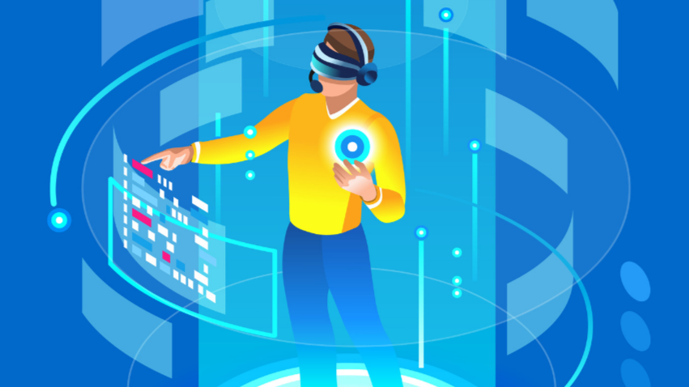
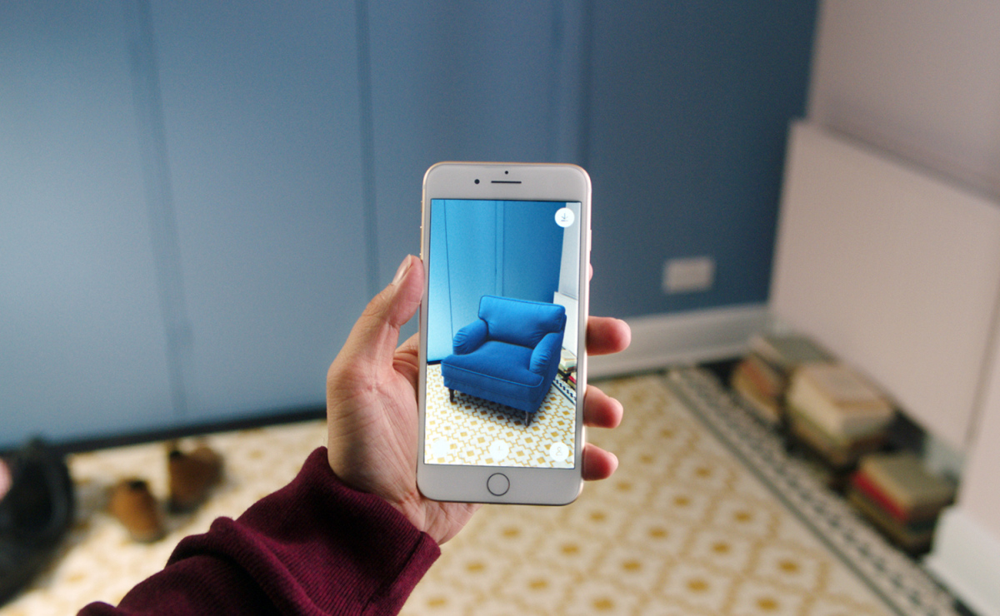
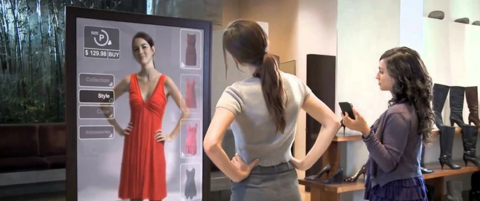
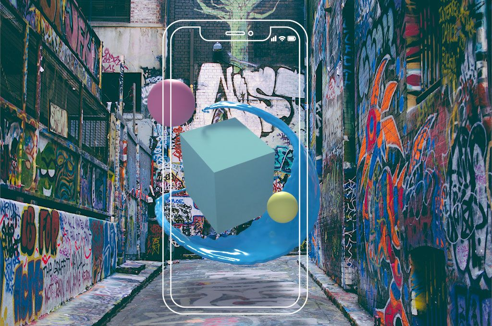
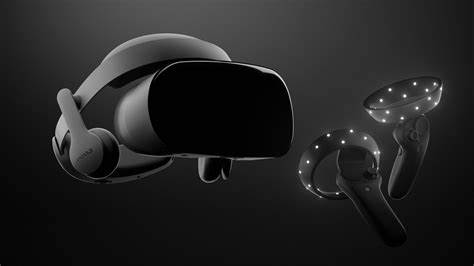
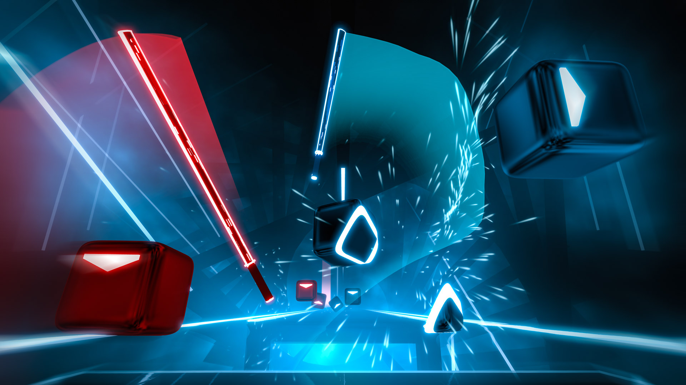

# What is XR?

## Objectives

- Define augmented reality and virtual reality.
- Explain the difference between marker-based and GPS based augmented reality applications.
- Identify practical use cases for augmented reality and virtual reality.

## Introduction

**Extended Reality** (XR) has become one of the more prominent areas of development following advancements in technology that enables us to digitally create, interact, and engage in augmented and virtual experiences. The phrase itself has taken on various meanings and continues to evolve to reflect the current XR landscape. More often, the phrase is used interchangeably with Mixed Reality (MR) - the merging of real and virtual worlds to produce new environments and visualizations, where physical and digital objects co-exist and interact in real time. We think of this technology as a spectrum from the physical world to an augmented world to a fully immersive virtual world and all the possibilities in between.

Source: [CHRP India](https://www.chrp-india.com/blog/extended-reality-the-new-age-immersive-technology-star/)

The two primary areas of XR are Augmented Reality and Virtual Reality.

### Augmented Reality

**Augmented Reality** (AR) encompasses composite interactive experiences that superimpose computer generated input over a user's view of the real world. Augmented reality experiences can go beyond just visual enhancements, as they can also include other sensory input such as sound, graphics or GPS data.

AR experiences are not tied to headsets, and actually can be accessed through a plethora of different devices. Mobile devices such as smartphones or tablets possess the necessary technology to support augmented reality experiences and as such, enhance the real world with digital information.

Source: [Medium](https://medium.com/@riyajohn9495/why-augmented-reality-is-important-5f558fab2a0f)

Many companies have resorted to AR to enhance their own applications, such as furniture stores allowing users to visualize how some of its virtual items would look in a given space. Fashion has also become an important exponent of AR technology through the usage of virtual mirror applications, where you can "try" on digital clothes or glasses using your phone's camera. Some stores have even replaced mannequins with models and products demonstrations only accessible through an AR app.

Source: [Shopify Retail Blog](https://www.shopify.com/retail/how-these-retailers-are-using-augmented-reality-to-enhance-the-customer-experience)

Moreover, AR is also used in fields such as entertainment and marketing. In live football (soccer) TV transmissions, AR is used to enhance the viewing experience by adding lines for offside calls, post-play analysis graphs and lately to assist Video Assistant Referees (VAR) in calls such as fouls and goals.

Source: [King5](https://www.king5.com/article/news/local/seattles-stunning-new-years-at-the-needle-show-goes-virtual-this-year/281-0ec1d1e2-543d-4fe2-bc07-37968691b905)

AR applications are generally either marker-based on GPS-based. **Marker-based** applications recognize a marker in the real world, and calculate its position and orientation to augment the reality. The outcome is an overlay of a virtual object, words, or image onto of the marker.

​

Source: [Assemblr Blog](https://blog.assemblrworld.com/3-different-types-of-marker/)

**GPS based** applications take advantage of Global Positioning System (GPS) tools in your phone. The applications use the position of your phone to find landmarks and any other point of interests near you.

Source: [Assemblr Blog](https://blog.assemblrworld.com/3-different-types-of-marker/)

### Virtual Reality

**Virtual Reality** (VR) experiences completely immerse the user in a virtual world through the use of a headset. As opposed to AR, VR makes the user lose visual connection to the real world, and as such are often used for training and simulations where users can benefit from total immersion to replicate a real life situation. To ensure a fully immersive environment, VR includes both visual and auditory enhancements.

VR applications are solely experienced through the use of a head mounted device. As a fully immersive experience, VR requires no outside information, and most commonly adds physical controllers that allow the user to interact with their virtual surroundings.

Source: [VRScout](https://vrscout.com/news/samsungs-odyssey-vr-headset-oled/)

VR is most commonly used in entertainment such as video-games, providing fully immersive experiences that allow its users to play through the game as a part of it, rather than as an spectator.

Source: [RoadtoVR](https://www.roadtovr.com/beat-saber-to-get-more-songs-expert-difficulty-and-pro-mode/)

However, VR also plays a pivotal role across other industries such as academics, where fully virtual classrooms are being developed with the goal of providing an in-person experience remotely.

### XR Use Cases

Many use cases across the spectrum of XR technologies are applicable to both AR and VR. Depending on it's intent, an AR experience can be adapted for a VR experience - and in some cases, a 2D experience. One such example is AltspaceVR, a social platform that enables people from all over the world to connect and collaborate in real team with a true sense of presence. Users can enjoy AltspaceVR in both VR as well as in 2D on a computer.

Source: [ARPost](https://arpost.co/2020/07/21/altspacevr-update-customization-options/)

Consider the examples below of XR use cases across various industries:

- _Design & Prototyping_:  Enables real-time collaborative iteration of 3D physical and virtual models across cross-functional teams and stakeholders.
- _Training & Development_: Provides instructors with better tools to facilitate teaching/coaching sessions. It offers trainees an enhanced and engaging learning experiences through 3D visualizations and interactivity.
- _Geospatial Planning_:  Enables the assessment and planning of indoor and outdoor environments (i.e. future construction sites, new store locations, interior designs) and removing the need for manual execution.
- _Sales Assistance_:   Improves the effectiveness of individuals in sales-oriented roles by providing tools such as 3D catalogs and virtual product experiences that increase customer engagement and strengthen buyer confidence.
- _Field Service_:  Improves the first-visit resolution and customer satisfaction of customer support issues. It is typically used for complex products that would otherwise require a field visit.  It can  serve as a platform for targeted up-sell opportunities, as well.
- _Productivity & Collaboration_:   Transform the space around you into a shared augmented workplace. Remote users can collaborate, search, brainstorm and share content as if they were in the same room

As technology continues to advance, additional real-world applications of XR technology will continue to grow.

## Post-Lecture Quiz

[Quiz](link-to-quiz-app)

## Supplemental Reading

We've identified the following resources to provide additional context and learning for the content reviewed in this lesson. We encourage you to review the material below and explore additional related topics.

- [XR Use Cases Fact Sheets](https://xra.org/public-policy/xr-use-cases-fact-sheets/)
