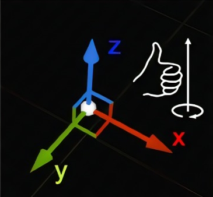
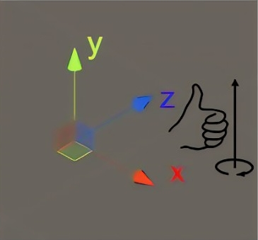
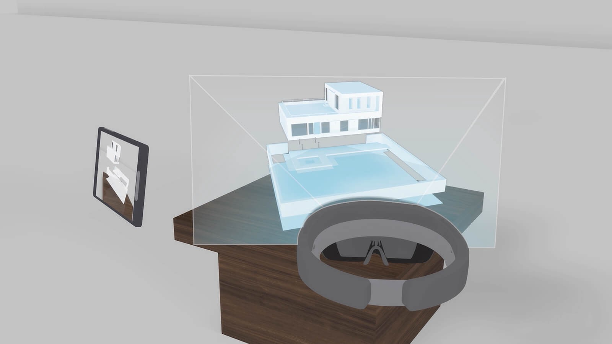

# Coordinate Systems and Anchors

## Objectives

- Identify the axes within the cartesian coordinate system.
- Recall that coordinate system orientation can differ by platform.
- Explain the benefit of anchors for augmented reality applications.

## Introduction

Whether on a physical or a virtual space, coordinate systems serve as a way to express the geometry of said space. These systems can be used to determine an object's position and orientation, the user's gaze or hand positions, and many other factors.

### Spatial Coordinate Systems

The most widely used system in 3D graphics is the cartesian coordinate system. The **cartesian coordinate system** establishes 3 perpendicular axes along which to position objects, an X, Y and Z axis.

Source: [Naturalis](https://naturalis.github.io/mebioda/doc/week1/w1d1/lecture2.html)

When a coordinate system has real meaning in the physical world, it is called a spatial coordinate system. A **spatial coordinate system** can express their coordinate values in real world measuring units, such as meters. This allows for real-world scaling when developing an application. For example, if we express 1 coordinate value = 1 meter, then two objects placed a unit apart in either the X, Y or Z axis will appear 1 meter apart from one another when rendered in an XR application.

The orientation of the cartesian coordinate system however, can change depending on the development environment being used. For example, Unreal Engine uses a left-handed, Z-up coordinate system, where X means the forward direction, Y means the right direction and Z the up direction.

Source: [A Clockwork Berry](http://www.aclockworkberry.com/basis-orientations-in-3ds-max-unity-3d-and-unreal-engine/)

Meanwhile, Unity uses a left-handed, Y-up coordinate system. In this scenario, the forward direction is dictated by Z, the right direction by X and the up direction by Y.

Source: [A Clockwork Berry](http://www.aclockworkberry.com/basis-orientations-in-3ds-max-unity-3d-and-unreal-engine/)

Understanding these differences is key to proper object placement, but should not be an issue provided the development environment remains the same.

### Anchors

In certain types of XR applications such as VR apps or games, establishing an absolute world coordinate system is common practice. This is due to the fact that in a purely virtual or immersive world we know all of the geometry in advance, and scaling or transforming the objects pose little challenge.

However, in AR applications, the understanding of the world is defined by a dynamic sensor (like a camera). As such, if objects are placed according to a single coordinate system, these objects might begin to move or drift as the sensor refines its understanding of the world.

Anchors provide the solution to this problem. As points that are defined within the spectrum of the real world, rather than inside the application's coordinate system, they can adjust their position based on one another to ensure their permanence in the right place.

Source: Microsoft

## Post-Lecture Quiz

[Quiz](link-to-quiz-app)

## Supplemental Reading

We've identified the following resources to provide additional context and learning for the content reviewed in this lesson. We encourage you to review the material below and explore additional related topics.

- [Coordinate Systems](https://docs.microsoft.com/windows/mixed-reality/design/coordinate-systems)
- [Spatial Anchors](https://docs.microsoft.com/windows/mixed-reality/design/spatial-anchors)
