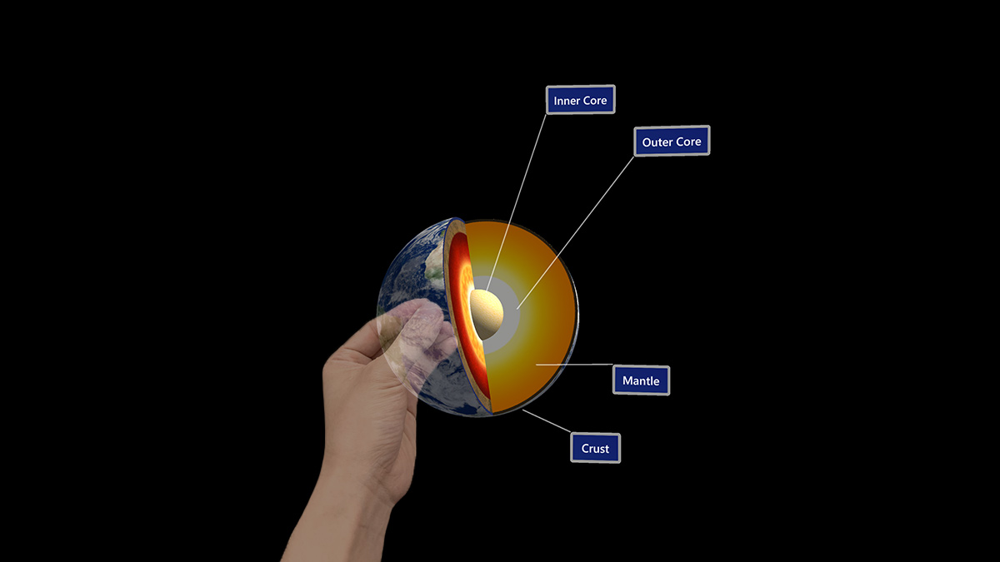
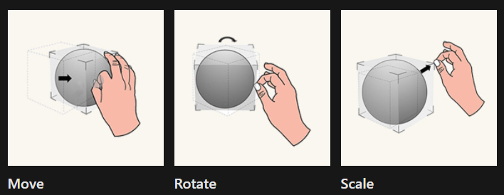
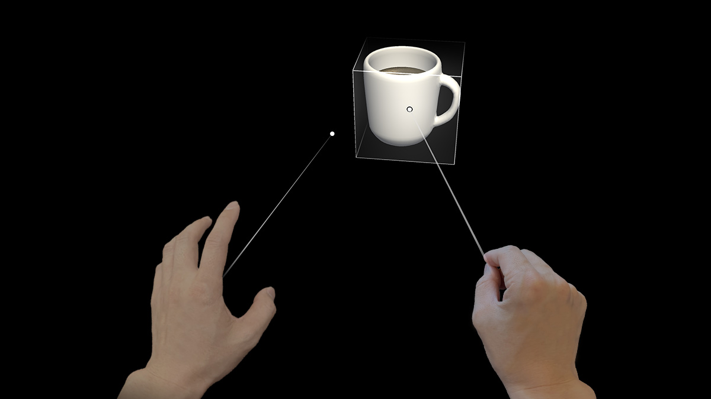

# Hands and Motion Controllers

## Objectives

- Summarize the hands and motion controllers modalities.
- Contrast affordance-based manipulation to non-affordance-based manipulation.
- Choose a modality best suited for an XR app or experience.

## Introduction

The hands and motion controllers model is ideal for applications that require users to use either one or two hands to interact with the virtual environment. Direct manipulation with hands provides the option of executing either  near or far interactions. Objects within reach (roughly 50 cm) are suitable for near interaction. Far interactions are typically accompanied by a tether or ray to manipulate an object from a distance.

There are three modalities for the hands and motion controllers input model:

- Direction manipulation with hands
- Point and commit with hands
- Motion controllers

### Direct Manipulation with Hands

**Direct manipulation** is an input model that involves touching 3D objects directly with your hands. The idea behind this concept is that objects behave just as they would in the real world. Buttons can be activated simply by pressing them, objects can be picked up by grabbing them, and 2D content behaves like a virtual touchscreen. There are no symbolic gestures to teach users. All interactions are built around a visual element that you can touch or grab.

Source: [Microsoft](https://docs.microsoft.com/en-us/windows/mixed-reality/design/design)

Direct manipulation can either be affordance or non-affordanced based. For **affordance-based manipulation**, markers or handles surrounds the object as an indicator of what you can do with the object. **Non-affordance-based manipulation** lacks such an indicator of manipulation. The possible manipulations are implied (ex: inherently knowing that buttons are typically pressed).

Source: [Microsoft](https://docs.microsoft.com/en-us/windows/mixed-reality/design/direct-manipulation)

### Point and Commit with Hands

**Point and commit with hands** is an input model that lets users target, select, and manipulate out of reach 2D and 3D content. Users first point at an object and then complete a secondary input to commit. A hand ray is typically used as a visual indicator of where the user points. It is recommended that hand rays come out from the center of the user's palm rather than their finger. Doing so provides the user with the ability to use their fingers to perform a commit using a finger-gesture (ex: pinch and grab).

Source: [Microsoft](https://docs.microsoft.com/en-us/windows/mixed-reality/design/point-and-commit)

### Motion Controllers

Motion controllers are hardware accessories that allow users to take action. An advantage of motion controllers over gestures is that the controllers have a precise position in space, allowing for fine grained interaction with virtual objects. Such hardware contains buttons on the device to trigger an action such as selecting or grabbing an object.

Source: [Medium](https://medium.com/designatmeta/designing-for-hands-in-vr-61e6815add99)

## Post-Lecture Quiz

[Quiz](https://ashy-plant-023e6671e.1.azurestaticapps.net/quiz/8)

## Supplemental Reading

We've identified the following resources to provide additional context and learning for the content reviewed in this lesson. We encourage you to review the material below and explore additional related topics.

- [Hands and Motion Controllers](https://docs.microsoft.com/windows/mixed-reality/design/hands-and-tools)
