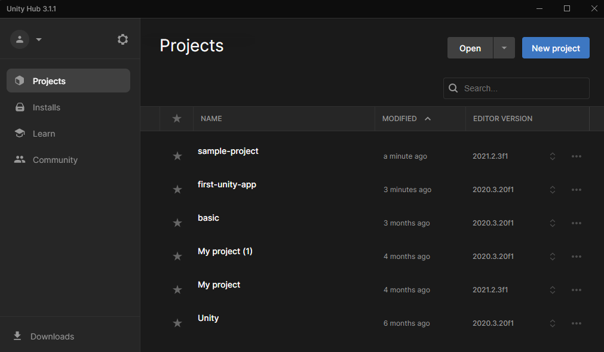
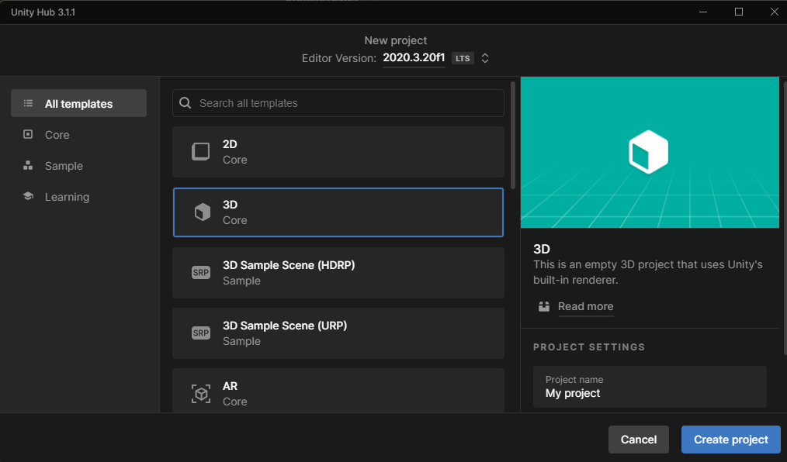
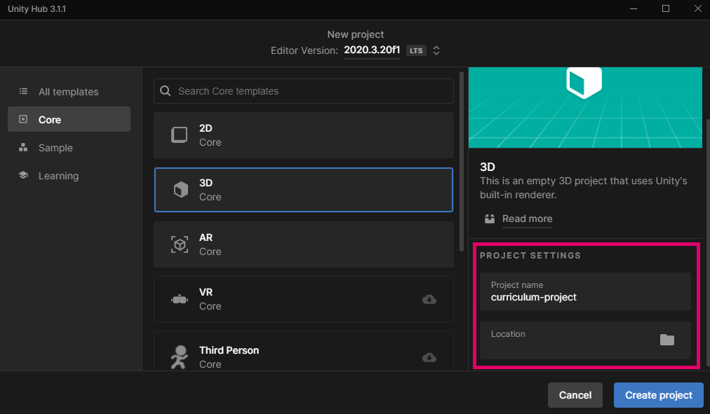

# Get Started with Unity

## Objectives

- Download and install the Unity Hub.
- Identify the required packages for XR development.
- Create a Unity project.

## Introduction

Unity is one of the leading real-time development platforms on the market, with underlying runtime code written in C++ and all development scripting is done in C#. Whether you're looking to build games, movies and animation cinematics, or even render architectural or engineering concepts in a virtual world, Unity has the infrastructure to support you.

### Unity Hub

The [Unity Hub](https://unity.com/unity-hub) allows you to download multiple Unity Editors and organize your projects in one place. Since Unity upgrades are not backward compatible, you have to open the projects with the same Unity version that it was created with. You can update a project to the latest Unity version, however that may require some debugging to resolve capability errors.

The following are system requirements for the Unity Hub:

**OS:**

- Windows 7 SP1+, 8, 10, 64-bit versions only
- Mac OS X 10.12+
- Ubuntu 16.04, 18.04, and CentOS 7

**GPU:**

- Graphics card with DX10 (shader model 4.0) capabilities

The Unity Hub interface contains four tabs: Projects, Learn, Community, and Installs. 

- **Projects** - Contains a list of all Unity projects that have been added to the Unity Hub. This tab is used to create new projects and adds projects you may have received from someone else. When a new project is created, it is added to the list in addition to it's Unity version, target platform, and the date that the project was last modified.

- **Learn**- Provides projects and tutorials created by Unity to help you learn.
- **Community** tab provides links to channels for engaging with the Unity community such as the Unity Forums and Unity Pulse - Unity's feedback platform.
- **Installs**: Contains a list of all Unity versions installed. You can install additional versions of Unity in this tab and add additional modules to existing versions installed.

### Unity Version

You can have more than one version of Unity installed. This can be useful if you're working on various projects that were all created with different versions of Unity. If you're starting from scratch with no version dependency, consider installing the latest LTS release version of Unity. A **LTS release** (long term support)  is a stable Unity version that's best for developing and shipping projects for an extended period. Alternatively, Unity also provides a non-LTS counterpart for all it's versions. A Beta version of an upcoming release is also available, however, we recommend to only use beta versions if you're comfortable with the Unity editor and familiar with debugging.

Each Unity version installed is supported with modules. These modules provide additional development support such as dev tools, platforms, documentation, and language packs. Once a Unity version is installed, you can retroactively add additional modules to a Unity version from the Installs tab. When adding a new Unity version via the Unity Hub, Unity only provides the most recent Unity version, LTS releases, and a Beta release. You can find and download older versions from the [Unity Download Archive](https://unity3d.com/get-unity/download/archive).

### Platforms

The platform modules are essential for Unity as it enables you to target different platforms when deploying your app. As it relates to XR development, Unity supports the following platforms:

- ARKit
- ARCore
- Microsoft HoloLens
- Windows Mixed Reality
- Magic Leap
- Oculus
- OpenXR
- PlayStation VR

The following are the most common platforms with build support for XR development:

- Universal Windows Platform (UWP)
- Android
- iOS

**Universal Windows Platform**

To build and run for Windows, you must install the Unity **Universal Windows Platform Build Support** platform module. Universal Windows Platform only shows in the Platform list if you're using Unity on a Windows computer. You'll also need Windows 10 and a Visual Studio 2019 (16.8 or higher). Visual Studio requires the following workloads:

- Desktop development with C++
- Universal Windows Platform (UWP) development
- Game development with Unity

Within the UWP workload, make sure the following components are included for installation:

- Windows 10 SDK version 10.0.19041.0 or 10.0.18362.0
- USB Device Connectivity
- C++ (v142) Universal Windows Platform tools

**Android**

To build and run for Android, you must install the Unity **Android Build Support** platform module. You also need to install the Android Software Development Kit (SDK) and the Native Development Kit (NDK) to build and run any code on your Android device. By default, Unity installs a Java Development Kit based on OpenJDK.

You can connect your Android device to your computer for both USB debugging and installing your app onto the deice. USB debugging requires that you enable Developer options on your device. Once enabled, you can connect your device to your computer using a USB cable. If you are developing on a Windows computer, you might need to install a device-specific USB driver.

**iOS**

To build and run for iOS, you must install the Unity **iOS Build Support** platform module. While you don't need an Apple Developer account to build to devices, it's recommended to set up an Apple Developer account to use Unity to it's full potential with iOS.

### Script Editor

Unity requires a code editor or Integrated Development Environment (IDE) to edit scripts. Such software contains a text-based code editor, a code debugger, and other useful tools for programming. The Unity Hub provides Visual Studio as a module to support this requirement. However, you're welcome to use an editor of your choice. Additional editors include:

- Visual Studio Code
- Project Rider
- Atom
- MonoDevelop

Selecting a script editor is a matter of personal preference. If you're unsure of which editor to select, we recommend Visual Studio.

### Create a Project

Projects are created within the **Projects** tab of the Unity Hub. Selecting the **New** button defaults to the latest Unity version for your project. If you have multiple Unity versions installed, you can select the drop down next to **New** to specify a version.

**Templates**

The Unity Hub provides three different types of templates:

- **Core Templates**: Most of these templates are specific to the type of application you wish to develop, serving as a quickstart to your needs. However, the 2D and 3D core templates serve as an empty canvas that can be utilized openly.

- **Sample Templates**: These templates provide a previously developed application, a 'sample' that can be used to test or learn more about the engine.

- **Learning Templates**: These templates encompass fully-fledged tutorials. These are great starting points to familiarize with Unity and learn more about the basics of development in the engine.

**Settings**

You can provide a name and location for the project within the **Settings**. Consider naming and organizing your Unity projects in such a manner that makes its easiest for you to differentiate between your projects.

## Post-Lecture Quiz

[Quiz](https://ashy-plant-023e6671e.1.azurestaticapps.net/quiz/16)

## Supplemental Reading

We've identified the following resources to provide additional context and learning for the content reviewed in this lesson. We encourage you to review the material below and explore additional related topics.

- [Set Your Default Script Editor](https://learn.unity.com/tutorial/set-your-default-script-editor-ide#612f3e91edbc2a1b4b4418ee)
- [Unity Essentials](https://learn.unity.com/pathway/unity-essentials)
- [Get Started with the Unity Hub](https://docs.unity3d.com/hub/manual/index.html)
