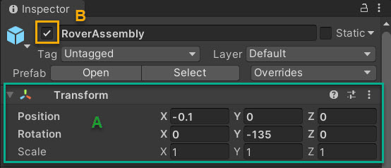
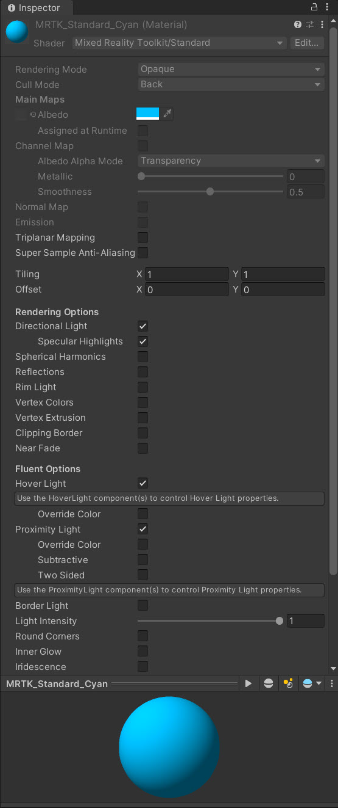
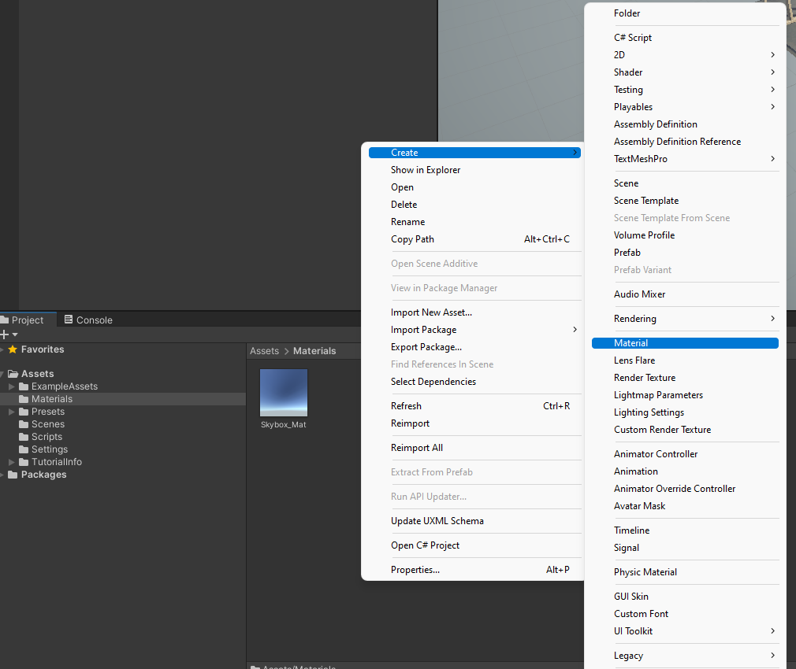
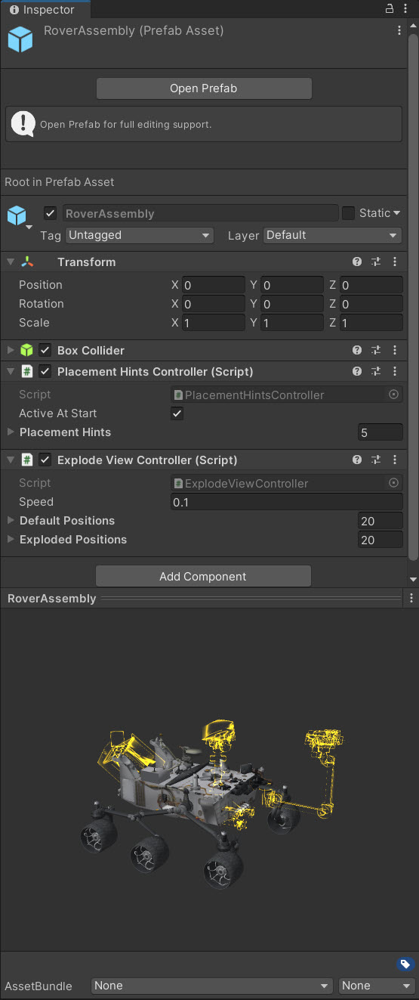

# Scene Objects

## Objectives

- Recall the required objects for a Unity scene to render 3D objects.
- Organize GameObjects into parent-child relationships.
- Identify components of a GameObject.

## Introduction

An app's scene contains various objects that bring your XR experiences to life. While some are optional, there are three required objects which must be included in scenes to render a 3D environment:

- Lights
- Cameras
- GameObject(s)

By default, Unity provides both a light and camera for newly created scenes. It is up you to include an object to render and modify object's properties to suit your app's needs.

### Cameras

A Unity scene represents GameObjects in a three-dimensional space. Since the viewer’s screen is two-dimensional, Unity needs to capture a view and “flatten” it for display. It does this using cameras.  Just as cameras are used in films to display the story to the audience, cameras in Unity are used to display the app scene to the user. You will always have at least one camera in a scene, but you can have more than one. For example, multiple cameras can give you a two-player split-screen.

### Lights

Lights are an essential part of every scene. They define the color and mood of your 3D environment. You’ll likely work with more than one light in each scene. Lighting in Unity works by approximating how light behaves in the real world - this also includes the light's **intensity** which is it's color and brightness. Unity uses detailed models of how light works for a more realistic result, or simplified models for a more stylized result. Light's other counterpart, shadows, add a degree of depth and realism to a Scene because they bring out the scale and position of objects that might otherwise look flat. In Unity, Lights can cast shadows from a GameObject onto other parts of itself, or onto nearby GameObjects.

**Direct light** is light that is emitted, hits a surface once, and is then reflected directly into a sensor (for example, the eye’s retina or a camera). 

**Indirect light** is all other light that is ultimately reflected into a sensor, including light that hits surfaces several times, and sky light. To achieve realistic lighting results, you need to simulate both direct and indirect light.

### GameObjects

Every object in your game is a **GameObject**, from characters and collectible items to lights, cameras and special effects. However, a GameObject can’t do anything on its own; you need to give it properties before it can become a character, an environment, or a special effect. 

GameObjects do not accomplish much in themselves but they act as containers for Components. **Components** define the behavior or functionality of the GameObject. Depending on what kind of object you want to create, you add different combinations of components to a GameObject. Unity has a lot of different built-in component types, and you can also make your own components with scripts.

Components on a GameObject are viewable in the Inspector window. Within each component are different **properties** that can be adjusted in the Editor or with scripts.

GameObjects always have a Transform component (A) attached which represents position, orientation, and scale. The Transform component is the only component that cannot be removed.

In the Hierarchy window, a check box displays next to the GameObject's name which indicates whether the object is active (B). When unmarked, the GameObject is temporarily removed from the Scene. For nested GameObjects, all child GameObjects are deactivated if it's parent GameObject is deactivated.

### Materials and Shaders

Materials work together with a shader to define the appearance of a GameObject. A **shader** contains code and instructions for the graphics card to execute. Materials can be re-used across multiple GameObjects without the need to create multiple materials of the same color.

You can create a new material within the Unity editor and leverage external assets such as textures to provide character. From an organizational perspective, consider placing all project materials into a **Materials** folder at the root of your project - likewise for **Textures**. To create a new material, in the **Project** window, either select the **+** followed by **Assets > Create > Material** *or* right click into the **Project Window** and select **Create > Material**.

Material properties can be modified within the **Inspector** window. To assign a material to a GameObject, select the material from the **Project** window and drag onto the GameObject.

### Transforms

Every GameObject has a **Transform** component, which determines its position, rotation and scale with respect to the scene. The Transform properties include:

|Property  |Function |
|---------|---------|
|`Position`     |   Determines the position of the Transform in X, Y, Z coordinates. If modified, the object will be moved as its position is changing.      |
|`Rotation`    |  Rotation of the Transform around the X, Y and Z axes. It is measured in degrees.       |
|`Scale`     |  TScale of the Transform along X, Y, and Z axes. Value "1" is the original size, and by changing it the object will change its size.       |

All three of the Transform's properties can be changed within the **Transform** component in the **Inspector** Window, or by utilizing the Transform Tools within the Toolbar.

### Prefabs

**Prefabs** are a collection of a GameObject's components, property values, and child GameObjects created as a reusable Asset. The Prefab Asset acts as a template from which you can create new Prefab instances in the Scene.

When you want to reuse a GameObject configured in a particular way (ex: a prop or piece of scenery) in multiple places in your Scene, or across multiple Scenes in your Project, you should convert it to a Prefab. This is better than simply copying and pasting the GameObject, because the Prefab system allows you to automatically keep all the copies in sync.

Any edits that you make to a Prefab Asset are automatically reflected in the instances of that Prefab, allowing you to easily make broad changes across your whole Project without having to repeatedly make the same edit to every copy of the Asset.

You can nest Prefabs inside other Prefabs to create complex hierarchies of objects that are easy to edit at multiple levels.

However, this does not mean all Prefab instances have to be identical. You can override settings on individual prefab instances if you want some instances of a Prefab to differ from others. You can also create variants of Prefabs which allow you to group a set of overrides together into a meaningful variation of a Prefab.

You should also use Prefabs when you want to instantiate (or create an instance) GameObjects at runtime that did not exist in your Scene at the start. For example, you can create prefabs to make special effects, projectiles, or objects appear at the right moments during app play.

## Post-Lecture Quiz

[Quiz](https://ashy-plant-023e6671e.1.azurestaticapps.net/quiz/19)

## Supplemental Reading

We've identified the following resources to provide additional context and learning for the content reviewed in this lesson. We encourage you to review the material below and explore additional related topics.

- [Camera Component](https://docs.unity3d.com/Manual/class-Camera.html)
- [Light](https://docs.unity3d.com/Manual/class-Light.html)
- [GameObjects](https://docs.unity3d.com/Manual/GameObjects.html)
- [Materials](https://docs.unity3d.com/Manual/Materials.html)
- [Prefabs](https://docs.unity3d.com/Manual/Prefabs.html)
