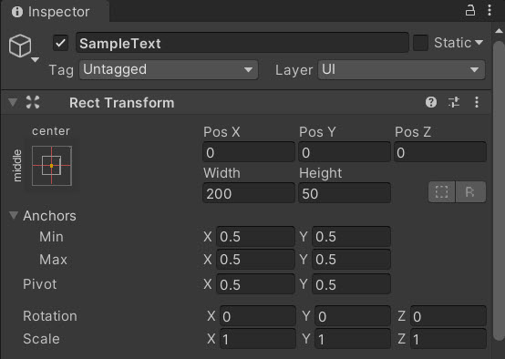
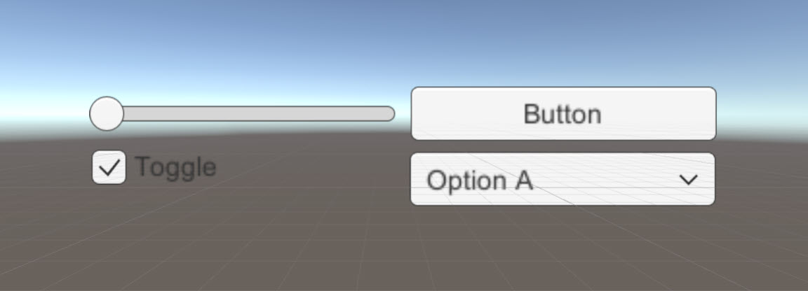

# User Interface

## Objectives

- Describe the relation between a Canvas and UI elements.
- Identify interactions provided by Unity.
- Explain the benefit of using TextMeshPro.

## Introduction

Unity provides provides the UI Toolkit and Unity UI for creating user interface objects. The UI Toolkit is the newest and recommended UI system for UI development projects. Alternatively, Unity also provides TextMesh Pro, another text solution package.

### Canvas

All UI elements are created within a Canvas. A **Canvas** represents the abstract space in which the UI is laid out and rendered. A Canvas component can be applied to any GameObject. All UI elements must be children of the Canvas. The UI elements within the Canvas are drawn (or rendered) in the order they appear in the hierarchy.

The Rect Tool is used to modify both the Canvas and it's children. When the Rect Tool is selected, a rectangle displays around the UI GameObject.

You can move, resize, and rotate UI elements via the Rect Tool. Alternatively, you could also perform the same tasks via the **Rect Transform** component in the **Inspector** window.

### TextMesh Pro

For a professional touch to creating text UI, we recommend using TextMesh Pro (TMP). TextMesh Pro is a package that provides greater flexibility for text styling and texturing. The package itself requires resources that must be imported into your project that are essential for using TextMesh Pro. If it's your first time accessing TextMesh Pro, Unity offers to import the aforementioned essentials which are then placed at the root of your project in a **TextMesh Pro** folder.

TextMesh Pro objects can be accessed in code. Doing so requires the `TMPro` namespace. Accessing in code enables you to dynamically add text UI to your scene - whether it's a string of data received from an API call or updating a player's score.

### Interaction Components

Rather than create interaction components from scratch, Unity provides several that can be added to your project. Most of the interaction components have some things in common. They are selectables, which means they have shared built-in functionality for visualizing transitions between states (normal, highlighted, pressed, disabled), and for navigation to other selectables using a keyboard or controller. The interaction components have at least one UnityEvent that is invoked when a user interacts with the component in specific way.

Unity provides the following interaction components:

- Button
- Toggle
- Toggle Group
- Slider
- Scrollbar
- Drop Down
- Input Field
- Scroll Rect (scroll view)

There is also a TextMeshPro version of the following interaction components:  

- Button
- Drop Down
- Input Field

There are XR dedicated toolkits available that provide similar interaction components for your XR projects. Such toolkits provide prefabs configured with a script which provides the interaction functionality. More often, you're able to add these components into your project without the need to modify code. However, you can access these components in code with the appropriate namespace. One such toolkit that provides UX features is the Mixed Reality Toolkit.

## Post-Lecture Quiz

[Quiz](link-to-quiz-app)

## Supplemental Reading

We've identified the following resources to provide additional context and learning for the content reviewed in this lesson. We encourage you to review the material below and explore additional related topics.

- [Creating User Interfaces](https://docs.unity3d.com/Manual/UIToolkits.html)
- [Interaction Components](https://docs.unity3d.com/Packages/com.unity.ugui@1.0/manual/UIInteractionComponents.html)
- [Welcome to MRTK](https://docs.microsoft.com/windows/mixed-reality/mrtk-unity/?view=mrtkunity-2021-05)
